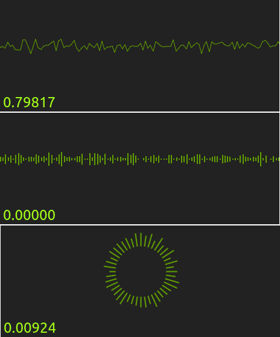

# perlin-experiment

A tiny WASM animation using Perlin Noise



[View Demo](http://tokyo800.jp/mina/perlin-experiment/)  
Click the canvas to toggle between 3 different visualization modes.

[1. About](#1-about)  
[2. Dev + Build](#2-dev--build)  
[3. What I Did](#3-what-i-did)  
&nbsp; &nbsp; [[Step 1] Source Directory for WASM](#step-1-source-directory-for-wasm)  
&nbsp; &nbsp; [[Step 2] Build Directory for WASM](#step-2-build-directory-for-wasm)  
&nbsp; &nbsp; [[Step 3] Writing `build.sh`](#step-3-writing-buildsh)  
&nbsp; &nbsp; [[Step 4] Subdirectory Issue](#step-4-subdirectory-issue)  
&nbsp; &nbsp; [[Step 5] Creating a Symlink](#step-5-creating-a-symlink)  
&nbsp; &nbsp; [[Step 6] `wasm-loader`](#step-6-wasm-loader)  
&nbsp; &nbsp; [[Step 7] `import.meta` (or `file://`)](#step-7-importmeta-or-file)  
&nbsp; &nbsp; [[Step 8] `application/wasm`](#step-8-applicationwasm)  
[4. Installed NPM Packages](#4-installed-npm-packages)  
&nbsp; &nbsp; [4-1. All](#4-1-all)  
&nbsp; &nbsp; [4-2. Babel](#4-2-babel)  
&nbsp; &nbsp; [4-3. Webpack](#4-4-webpack)  
&nbsp; &nbsp; [4-4. Other Build Tools](#4-4-other-build-tools)  
[5. LICENSE](#5-license)

## 1. About

- Generating an organic looking wave using Perlin Noise
- Click the canvas to toggle between 3 different visualization modes (Wave/Equalizer/Solar).
- Show the current amplitude value in a control panel underneath
- So, the app is handling 2 DOM elements: `#wave` and `#control`

I have some example apps from the past:

- [wasm-pack-canvas-example](https://github.com/minagawah/wasm-pack-canvas-example)
  - Has exactly the same setup
- [iced-dynamic-import-sample](https://github.com/minagawah/iced-dynamic-import-sample)
  - Similar, but it uses `wasm-bindgen` intead of `wasm-pack`

So, the descriptions are almost the same as the ones above,
and most of what I have in this README is a repetition.

Yet, remember, the key is **_to make a symlink from the JS to the built WASM files._**  
When Webpack tries to look for `perlin-wave` which is a WASM package,
Webpack can look up the package because I did `yarn link "perlin-link"`
in the JS source directory.

Just like I did in the previous examples,
it would be worth showing the directory structure:

```
├── build.sh
├── public
│   ├── assets
│   │   │ # This is the Webpack output
│   │   │ # directory where JS, CSS,
│   │   │ # or any other resources
│   │   │ # will be served.
│   │   │
│   │   ├── app.xxxxxxxxxxxxxxxxxxxx.js
│   │   └── favicon.ico
│   │
│   │ # While `index.html` is usually
│   │ # emitted to Webpack output directory,
│   │ # instead, emitting `index.html`
│   │ # to its UPPER DIRECTORY.
│   │
│   ├── index.html
│   │
│   └── wasm
│       └── perlin-wave
│           │ # After `cargo build`, we run
│           │ # `wasm-pack` in `build.sh`
│           │ # and output the generated
│           │ # set of package here.
│           │
│           ├── package.json
│           ├── perlin-wave_bg.wasm
│           ├── perlin-wave_bg.wasm.d.ts
│           ├── perlin-wave.d.ts
│           └── perlin-wave.js
│
├── src
│ # This is where JS codes reside.
│
└── src_for_wasm
    │ # This is where Rust codes reside.
    │
    └── perlin-wave
        ├── Cargo.lock
        ├── Cargo.toml
        ├── src
        │   ├── app.rs
        │   ├── constants.rs
        │   ├── graphics
        │   │   ├── mod.rs
        │   │   ├── control.rs
        │   │   └── wave.rs
        │   ├── lib.rs   # This is the module root
        │   ├── panels
        │   │   ├── mod.rs
        │   │   ├── control.rs
        │   │   └── wave.rs
        │   ├── perlin.rs
        │   ├── types.rs
        │   └── utils.rs
        │
        └── target
            │ # This is where `cargo build`
            │ # will build WASM binaries.
            │
            └── wasm32-unknown-unknown
```

&nbsp;

## 2. Dev + Build

### Dev

```
### IMPORTANT

After you clone the repo, make sure that you:

1. Build the WASM app
2. Make a symlink

git clone https://github.com/minagawah/perlin-experiment.git
cd perlin-experiment
yarn build:wasm

cd public/wasm/perlin-wave
yarn link
cd ../../../src
yarn link "perlin-wave"

Further details described in:
# 3. What I Did - [Step 5] Creating a Symlink
```

Once you have the WASM built and the symlink, then you are all set for development.  
Here is a possible scenario:

```
# Frist, build WASM files.
yarn build:wasm

# Next, start a dev server at: localhost:8080
yarn start
```

### Prod

This will build for both JS and WASM:

```
yarn build
```

&nbsp;

## 3. What I Did

Many steps are similar to my previous example,
[iced-dynamic-import-sample](https://github.com/minagawah/iced-dynamic-import-sample),
but instead of using `wasm-bindgen`, this time, using `wasm-pack`.

When imporing WASM from JS, we need special preparations.  
I will describe the steps in detail:

#### [Step 1] Source Directory for WASM

Creating source directory for Rust: `src_for_wasm/perlin-wave`

```
mkdir src_for_wasm
cargo new perlin-wave
cd perlin-wave
```

#### [Step 2] Build Directory for WASM

When running `cargo build`, it builds the binaries to
`src_for_wasm/perlin-wave/target/wasm32-unknown-unknown/release/*.wasm`.
Out of this, `wasm-pack` generates a package into `public/wasm/perlin-wave`.
So, we need to prepare the directory:

```
mkdir -p public/wasm/perlin-wave
```

#### [Step 3] Writing `build.sh`

When running `yarn build:wasm`, it will execute:

```
sh ./build.sh perlin-wave release
```

and this is what we have in `build.sh`:

```bash
#!/usr/bin/env bash

APP=${1%\/}
PROFILE=${2:=debug}

ROOT_DIR="$PWD"

SRC_DIR="$ROOT_DIR/src_for_wasm/$APP"
OUT_DIR="$ROOT_DIR/public/wasm/$APP"

cd "$SRC_DIR"
wasm-pack build "--$PROFILE" --target web --out-name "$APP" --out-dir "$OUT_DIR"
```

This will output `perlin-wave` package in `public/wasm/perlin-wave`:

```
$ ls -1 public/wasm/perlin-wave/
package.json
perlin-wave_bg.wasm
perlin-wave_bg.wasm.d.ts
perlin-wave.d.ts
perlin-wave.js
```

`public/wasm/perlin-wave/package.json`

```json
{
  "name": "perlin-wave",
  "collaborators": [],
  "version": "0.1.0",
  "files": ["perlin-wave_bg.wasm", "perlin-wave.js", "perlin-wave.d.ts"],
  "module": "perlin-wave.js",
  "types": "perlin-wave.d.ts",
  "sideEffects": false
}
```

#### [Step 4] Subdirectory Issue

For HTML & JS, we want these:

```html
<div id="container">
  <div id="wrapper">
    <div id="wave"></div>
    <div id="control"></div>
  </div>
</div>
```

```js
import init, * as PerlinWave from 'perlin-wave';

import './styles.css';

const WASM_PATH =
  NODE_ENV && NODE_ENV === 'production'
    ? 'wasm/perlin-wave/perlin-wave_bg.wasm'
    : void 0;

const CANVAS_PANELS = [
  {
    id: 'control',
    ratio: 15.0 / 1.0,
    color: '#c0e822',
  },
  {
    id: 'wave',
    ratio: 3.0 / 1.0,
    color: '#759203',
  },
];

const APP_CONFIG = {
  bgcolor: '#222',
  panels: CANVAS_PANELS.reduce(panelsReducer, []),
};

document.addEventListener('DOMContentLoaded', () => {
  init(WASM_PATH)
    .then(() => {
      PerlinWave.run(APP_CONFIG);
    })
    .catch(err => {
      console.error(err);
    });
});

if (typeof module.hot !== 'undefined') {
  module.hot.accept();
}

function panelsReducer(acc = [], { id, ratio, color }) {
  const key = `#${id}`;
  const el = document.querySelector(key);
  if (el) {
    const width = (el.offsetWidth || 0).toFixed(1);
    const height = (width / ratio).toFixed(1);
    acc.push({
      id,
      color,
      width,
      height,
    });
    el.style.height = `${height}px`;
  }
  return acc;
}
```

It is a bit long, but if you take a closer look,
you will notice it is mostly doing things
that has nothing to do with using wasm files,
but just calculating for width and height of the wrapper elements.

However, you may notice what the heck `WASM_PATH` is all about?  
Why it is passing `WASM_PATH` as an argument?  
Well, this is about the "directory" you serve your assets from.  
If I were to serve my assets from site's directory root, there is no need for passing the argument.  
Like this:

```js
init()
  .then(() => {
    //
```

However, I am serving all the assets from the following subdirectory:  
http://tokyo800.jp/mina/perlin-wave/

Let's say we feed nothing for `init`, then it would fetch following (which results in 404):  
http://tokyo800.jp/perlin-wave/perlin-wave_bg.wasm  
Instead, I want this:  
http://tokyo800.jp/mina/perlin-experiment/wasm/perlin-wave/perlin-wave_bg.wasm

When the path is not given, it will fetch for: `/perlin-wave/perlin-wave_bg.wasm`  
This is not even close to `/mina/perlin-waves` where I have my assets!!!!  
So, the point is, when a path is not given, it will fetch for the _ABSOLUTE PATH_ as a default.  
To avoid this, I must explicity pass a _RELATIVE PATH_ which is `wasm/perlin-wave/perlin-wave_bg.wasm`

&dash;&dash;

Also, I need to be careful with what to set for `publicPath` in Webpack config.

Currently, I have this:

```js
  output: {
    filename: '[name].[fullhash].js',
    path: path.resolve(__dirname, 'public/assets'),
    publicPath: 'assets',
  },
```

Meaning, I am serving the JS assets from: http://tokyo800.jp/mina/perlin-experiment/assets  
What if, instead of `assets`, I had `/assets`?  
Well... That would be disasterous...  
When my HTML page is generated, it will look like this:

```html
<script src="/assets/app.f459b8e437cbd3fa6595.js">
```

As you can see, it will result in 404...

So, if you had your assets in a subdirectory,
make sure you have a _RELATIVE PATH_ for `publicPath`.

&dash;&dash;

Notice, also, that I am explicitly specifying
`void 0` (which is another way of saying `undefined`)
when we are not passing a path to the WASM file.
This does not usually become an issue,
but it may sometimes become a cause of raising
a runtime error especially when we are using
canvas related features.

We need to explicitly pass `undefined`
because a predicate defined in `init`
strictly checks against `undefined`.
Otherwise, when initializing the WASM app, in:

```js
WebAssembly.instantiate(bytes, imports);
```

the first argument becomes empty.

&dash;&dash;

Also, for those of you don't know, Webpack5 was released on Jan. 12, 2021,
and it no longer supports `process.env`,
and you need to manually define envs like `NODE_ENV` yourself in Webpack config.

&nbsp;

#### [Step 5] Creating a Symlink

In order for JS to lookup `perlin-wave` as a module (not runtime, but build-time),
we are using `yarn link` to create a symlink within `src`
so that it links to `public/wasm/perlin-wave`.

Notice that we have "perlin-wave" for the package name
because is defined so in `public/wasm/perlin-wave/package.json`
(which we generated with `build.sh`).

```
cd public/wasm/perlin-wave
yarn link
--------------------------------------------
yarn link v1.22.5
warning package.json: No license field
warning package.json: No license field
success Registered "perlin-wave".
info You can now run `yarn link "perlin-wave"` in the projects where you want to use this package and it will be used instead.
Done in 0.08s.
--------------------------------------------
```

Now, visit `src`, and link it to the one just registered:

```
cd src
yarn link "perlin-wave"
```

#### [Step 6] `wasm-loader`

We need more setups to handle `*.wasm` files.
First of all, we must tell Webpack, instead of `file-loader`, but to use `wasm-loader`:

`webpack.base.js`

```js
  {
    test: /\.wasm$/,
    include: path.resolve('public/wasm'),
    use: [
      {
        loader: require.resolve('wasm-loader'),
      },
    ],
  },
```

#### [Step 7] `import.meta` (or `file://`)

Now, if you take a look at `public/wasm/perlin-wave/perlin-wave.js`,
`init` function starts like this:

```js
async function init(input) {
    if (typeof input === 'undefined') {
        input = import.meta.url.replace(/\.js$/, '_bg.wasm');
    }
```

Notice `import.meta` syntax for which Webpack has no idea how to deal with it.
So, we will add `babel-plugin-bundled-import-meta` in `babel.config.js`
to tell Webpack that we are importing `*.wasm` files as CJS modules.

`babel.config.js`

```js
  plugins: [
    [
      'babel-plugin-bundled-import-meta',
      {
        bundleDir: 'public/wasm',
        importStyle: 'cjs',
      },
    ],
  ],
```

This is not just about `import.meta`,
but this is about explicitly telling Webpack how to dynamically import `*.wasm`.
Without it, Webpack attempts to fetch it via `file://`, and that is not what we want.
Also, notice `bundleDir: 'public/wasm'` is needed
only when the directory you have WASM files are differnt from your Webpack output directory.

#### [Step 8] `application/wasm`

Remember that we are using `webpack-dev-server` in development.
And, you certainly need to print a MIME header for `*.wasm` files.

`webpack.dev.js`

```js
  devServer: {
    contentBase: path.resolve(__dirname, './public'),
    hot: true,
    port: 8080,
    // Access to `/assets` should resolve (without 404)
    writeToDisk: true,
    before: app => {
      app.get('*.wasm', (req, res, next) => {
        const options = {
          root: path.join(__dirname, 'public/wasm'),
          dotfiles: 'deny',
          headers: {
            'Content-Type': 'application/wasm',
          },
        };
        res.sendFile(req.url, options, err => {
          if (err) {
            console.warn(err);
            next(err);
          }
        });
      });
    },
  },
```

Make sure also that you have `.htaccess` (or whatever for clouds)
in your production server to print `application/wasm` for any `*.wasm` files served.

Here is what I have:

```
% cat .htaccess
AddType application/wasm .wasm

Order Deny,Allow
Deny From All
Allow From All

DirectoryIndex index.html index.php
```

&nbsp;

## 4. Installed NPM Packages

### 4-1. All

```
yarn add --dev @babel/core @babel/preset-env @babel/cli core-js@3 @babel/runtime-corejs3 babel-loader babel-plugin-bundled-import-meta webpack webpack-cli webpack-dev-server file-loader css-loader style-loader postcss-loader wasm-loader autoprefixer webpack-merge clean-webpack-plugin html-webpack-plugin copy-webpack-plugin mini-css-extract-plugin license-webpack-plugin prettier pretty-quick
```

### 4-2. Babel

For `@babel/polyfill` has been deprecated, we use `core-js`.

- @babel/core
- @babel/cli
- @babel/preset-env
  - `useBuiltIns: 'usage'` in `babel.config.js` will automatically insert polyfills.
- core-js@3
  - For `@babel/polyfill` has been deprecated.
- @babel/runtime-corejs3
- babel-loader
  - We want Babel to read `.babelrc` (or `babel.config.js`).
- babel-plugin-bundled-import-meta
  - WASM package uses `import.meta` syntax to dynamically import `*.wasm` files, and we want Babel to treat them as CJS modules. Also, we want to avoid the files to be fetched via `file://`.

```
yarn add --dev @babel/core @babel/preset-env @babel/cli core-js@3 @babel/runtime-corejs3 babel-loader babel-plugin-bundled-import-meta
```

### 4-3. Webpack

- webpack
- webpack-cli
- webpack-dev-server
- file-loader
- css-loader
- style-loader
  - This is for development only. For production, we are using `mini-css-extract-plugin`.
- postcss-loader
- wasm-loader
  - Instead of `file-loader`.
- autoprefixer
- webpack-merge
- clean-webpack-plugin
- html-webpack-plugin
  - Template is in `src/index.html`, and outputs `public/index.html`.
- copy-webpack-plugin
  - Just to copy `src/assets` to `public/assets`.
- mini-css-extract-plugin
  - While we are extracting CSS files, and write them to disks, this is for production only.
- license-webpack-plugin
  - Extracts license information for production.

```
yarn add --dev webpack webpack-cli webpack-dev-server file-loader css-loader style-loader postcss-loader wasm-loader autoprefixer webpack-merge clean-webpack-plugin html-webpack-plugin copy-webpack-plugin mini-css-extract-plugin license-webpack-plugin
```

### 4-4. Other Build Tools

- prettier
- pretty-quick

```
yarn add --dev prettier pretty-quick
```

&nbsp;

## 5. License

Dual-licensed under either of the followings.  
Choose at your option.

- The UNLICENSE ([LICENSE.UNLICENSE](LICENSE.UNLICENSE))
- MIT license ([LICENSE.MIT](LICENSE.MIT))
